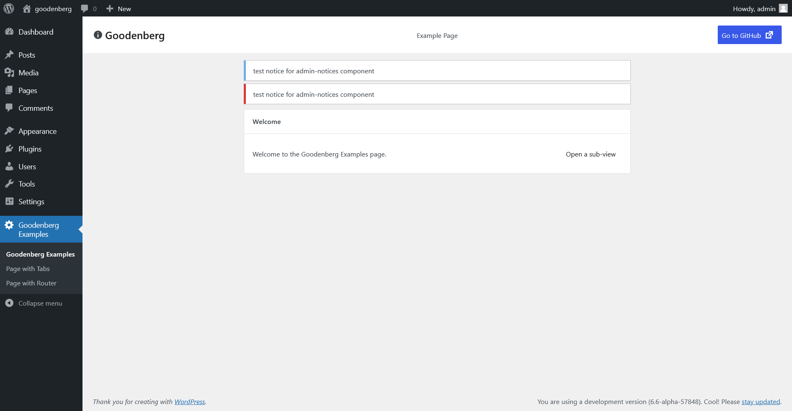

# Goodenberg Admin Components

React components, hooks, and utils for building pages in the wp-admin. Useful for building custom plugin pages, settings
pages, etc.



## Page

A component to build a complete wp-admin page, including a base layout and styling.

### Parameters

- `name` (string): The name (slug) of the page. Used for CSS classes.
- `children`: Any components to render on the page. Use Page.Header, TabPanel, Container, ... components.
- Any other props will be passed to the wrapper (via the Layout component).

### Page.Header

A header bar for wp-admin pages, uses the Bar component.

- `title` (string): The page title to display.
- [`icon`] (IconType): The icon to display. Passed to the Icon component.
- [`actions`] (React.ReactElement): The actions to display.
- [`className`] (string): Additional CSS classes for the wrapper.
- `children` (React.ReactNode): Children to render in the center of the header.
- Any other props will be passed to the Bar component.

## AdminNotices

A "slot" which will render all admin notices that were rendered on the server via `admin_notices` hook.
Will move all notices into this wrapper. Use it inside the Page component (e.g., between Header and Content).

Any props will be passed to the wrapper component.

## Bar

A full-width navigation bar for headers/footers on admin pages. Used in Page.Header component.

- [`start`] (React.ReactNode): Elements to render at the start/left of the bar.
- [`center`] (React.ReactNode): Elements to render in the center of the bar.
- [`end`] (React.ReactNode): Elements to render at the end/right of the bar.
- [`hasTopMargin`] (boolean): Whether to add a top margin to the header.
- [`hasBottomMargin`] (boolean): Whether to add a bottom margin to the header.
- Additional props will be passed to the wrapper.

## Container

A centered container which has a configurable default max-width.

- [`contained`] (bool|string): True to use the default container width, string to set a custom max-width.
- [`as`] (string|React.ReactElement): A component or HTML tag as which to render the container (e.g. `main`).
- `children` (React.ReactNode): Any components to render inside the container.
- Any other props will be passed to the wrapper.

## TabPanel

A styled version of WordPress TabPanel component to be used on admin pages, for example, right beneath
your `Page.Header`.

See [core TabPanel Package documentation](https://developer.wordpress.org/block-editor/reference-guides/components/tab-panel/)
for possible props.

### UrlSyncedTabPanel

A TabPanel which loads its initial tab from the `tab` URL Parameter and syncs changing the tab back to the URL.

### Example

```js
import {
    AdminNotices,
    Container,
    Page,
} from "@goodwp/goodenberg/admin/components";

const ExamplePage = () => {
    return (
        <Page name="goodenberg-examples">
            <Page.Header
                title={__("Goodenberg", "goodenberg-examples")}
                icon="info"
                actions={<PageActions/>}
                hasBottomMargin
            >
                <p>{__("Example Page", "goodenberg-examples")}</p>
            </Page.Header>
            <Container contained>
                <AdminNotices/>
                <Panel header={"Welcome"}>
                    <PanelBody>
                        <PanelRow>
                            <p>Welcome to the Goodenberg Examples page.</p>
                        </PanelRow>
                    </PanelBody>
                </Panel>
            </Container>
        </Page>
    );
};
```