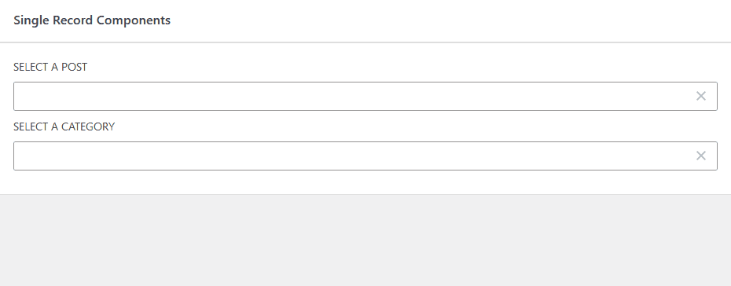

# EntityRecordSelect Component

The `EntityRecordSelect` is a component which allows a user to select a single record (post, term, etc.).
It allows searching, selecting from a pre-defined static list of options and loading an initial list of records.



Uses `getEntityRecords` and `ComboboxControl` under the hood.

## Props

- `type` (string): Entity record type ("postType", "taxonomy", etc.)
- `subType` (string): Entity record subtype (postType, taxonomy, etc.)
- `value` (int): The ID of the selected record.
- `onSelect` (Function: (id: int) => void): Callback function triggered when a new value is selected. It gets passed
  the ID of the record.
- `loadInitial` (bool): Boolean indicating whether to load some initial values. Will run a default query for the
  type+subtype.
- `extraOptions` (array: <{label: string, value: int}>): Static extra options to show in the select.
- `buildOptionLabel` (Function: (record: EntityRecord) => string | null): Optional callback function to build labels for
  the
  options. Receives the record and must return a string. By default, the "title" or "name" property will be used.
- `queryArgs` (object): Additional query arguments to pass to the API.
- `props`: Additional props passed to the `ComboboxControl`.

## Example:

```js
import { EntityRecordSelect } from '@goodwp/goodenberg/components';

const BlockEdit = ({ attributes, setAttributes }) => {
    // Attribute of type int
    const { post } = attributes;
    const updatePost = (nextPost) => {
        setAttributes({ post: nextPost });
    }

    const extraOptions = [
        {
            // Display a dynamic option "latest post" in the select.
            label: __("Latest post", "my-plugin"),
            value: -1,
        },
    ];

    return (
        <InspectorControls>
            <PanelBody title={__("Select a post", "my-plugin")}>
                <PanelRow>
                    <EntityRecordSelect
                        label={__("Post", "my-plugin")}
                        type="postType"
                        subType="post"
                        value={post}
                        loadInitial
                        extraOptions={extraOptions}
                        onSelect={updatePost}
                    />
                </PanelRow>
            </PanelBody>
        </InspectorControls>
    );
};
```

See the examples directory for more concrete implementations.

## Variants

For easier usage `PostSelect` and `TermSelect` components are provided as well.

### `PostSelect`

- `postType` (string): The post type from which to select a post.
- `buildOptionLabel` (Function) Callback to build labels for the options. Default to a function returning the posts'
  title.
- Accepts all the other props like `EntityRecordSelect`.

### `TermSelect`

- `taxonomy` (string): The taxonomy from which to select a term.
- `buildOptionLabel` (Function) Callback to build labels for the options. Default to a function returning the terms'
  name.
- Accepts all the other props like `EntityRecordSelect`.