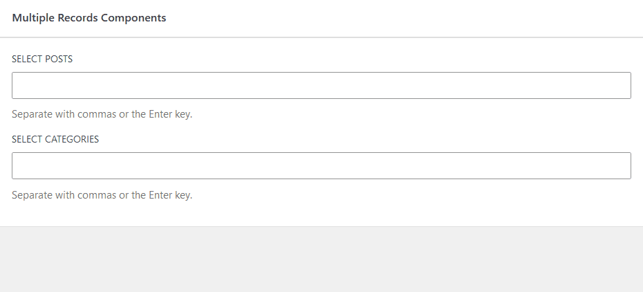

# EntityRecordsSelect Component

The `EntityRecordsSelect` is a component which allows a user to select multiple records (post, term, etc.).
It allows searching, selecting from a pre-defined static list of options and loading an initial list of records.



The component works best for selecting terms. It works with posts as well, but the long names might not
display well.
Based
on [`TaxonomyItem`](https://github.com/WordPress/gutenberg/blob/trunk/packages/block-library/src/query/edit/inspector-controls/taxonomy-controls.js)
from the core/query block.

Uses `getEntityRecords` and `FormTokenField` under the hood.

## Props

- `type` (string): Entity record type ("postType", "taxonomy", etc.)
- `subType` (string): Entity record subtype (postType, taxonomy, etc.)
- `values` (int[]): The IDs of the selected records.
- `onSelect` (Function: (ids: int[]) => void): Callback function triggered when a new value is selected. It gets passed
  all IDs of the records.
- `loadInitial` (bool): Boolean indicating whether to load some initial values. Will run a default query for the
  type+subtype.
- `buildOptionLabel` (Function: (record: EntityRecord) => string | null): Optional callback function to build labels for
  the
  options. Receives the record and must return a string. By default, the "title" or "name" property will be used.
- `queryArgs` (object): Additional query arguments to pass to the API.
- `props`: Additional props passed to the `FormTokenField`.

## Example:

```js
import { EntityRecordsSelect } from '@goodwp/goodenberg/components';

const BlockEdit = ({ attributes, setAttributes }) => {
    // Attribute of type array
    const { terms } = attributes;
    const updateTerms = (nextTerms) => {
        setAttributes({ terms: nextTerms });
    }
    return (
        <InspectorControls>
            <PanelBody title={__("Filters", "my-plugin")}>
                <PanelRow>
                    <EntityRecordsSelect
                        label={__("Categories", "my-plugin")}
                        type="taxonomy"
                        subType="category"
                        values={terms}
                        loadInitial
                        onSelect={updateTerms}
                    />
                </PanelRow>
            </PanelBody>
        </InspectorControls>
    );
};
```

See the examples directory for more concrete implementations.

## Variants

For easier usage `PostsSelect` and `TermsSelect` components are provided as well.

### `PostsSelect`

- `postType` (string): The post type from which to select posts.
- `buildOptionLabel` (Function) Callback to build labels for the options. Default to a function returning the posts'
  title.
- Accepts all the other props like `EntityRecordsSelect`.

### `TermsSelect`

- `taxonomy` (string): The taxonomy from which to select terms.
- `buildOptionLabel` (Function) Callback to build labels for the options. Default to a function returning the terms'
  name.
- Accepts all the other props like `EntityRecordsSelect`.